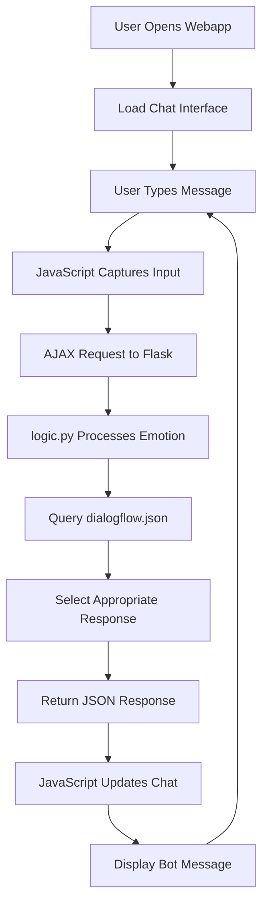

# Real-Time Chatbot with Emotion-Based Responses

## 🌟 Project Overview

This project implements a real-time chatbot that combines simple rule-based logic with emotion triggers to deliver appropriate responses. The system leverages Flask for backend processing, custom dialogue management and emotion-based triggers to create an engaging conversational experience.
The users can enjoy their time by sharing their thoughts & feelings to a chatbot which responds in real-time based on the predefined logic. The WebApp has access to quick buttons for simplicity and ease or users can write their message as well in the chat area.

**Live Demo:** [https://real-time-chatbot-1.onrender.com](https://real-time-chatbot-1.onrender.com)

---

## 🎯 Project Approach

Our approach centers around developing a **human-like conversational experience** by integrating rule-based logic into chatbot responses. Now, Users can enjoy seamless conversation with the chatbot and can vent their frustation which makes their mood lighter. We've implemented a sophisticated system that:

1. **Analyzes user input** for emotional intent
2. **Triggers appropriate responses** based on emotions
3. **Maintains conversation flow** through structured dialogue management
4. **Provides real-time interaction** with minimal latency

### Technical Strategy
- **Modular Architecture**: Separation of concerns with distinct files for logic, data, and presentation
- **Emotion-Driven Logic**: Custom algorithms to detect and respond to user emotions
- **Scalable Design**: Cloud-hosted solution with responsive frontend
- **Data-Driven Responses**: JSON-based dialogue system for easy maintenance and updates

---

## 🏗️ System Architecture

```
┌─────────────────┐    ┌──────────────────┐    ┌─────────────────┐
│   Frontend      │    │   Flask Backend  │    │   Data Layer    │
│   (HTML/CSS/JS) │◄──►│   (app.py)       │◄──►│   (JSON files)  │
└─────────────────┘    └──────────────────┘    └─────────────────┘
         │                        │                        │
         │                        │                        │
         ▼                        ▼                        ▼
┌─────────────────┐    ┌──────────────────┐    ┌─────────────────┐
│ User Interface  │    │ Emotion Logic    │    │ Dialogue System │
│ - Chat Display  │    │ (logic.py)       │    │ (dialogflow.json)│
│ - Input Field   │    │ - Sentiment      │    │ - Triggers      │
│ - Animations    │    │ - Context        │    │ - Responses     │
└─────────────────┘    └──────────────────┘    └─────────────────┘
```

---

## 📁 Project Structure & File Documentation

### **app.py** -
This is the main Flask application server handling HTTP requests and routing. It initializes Flask web server and integrates emotion logic with dialogue flow.

### **logic.py** - 
It is the main functional module for emotion detection and response logic. It maps detected emotions to appropriate response categories by choosing responses based on dialog flow.

### **dialogflow.json** -
It contains the structured dialogue system containing all bot responses and triggers. It is predefined but can be modified later for further enhancement.

### **index.html** -
It is responsible for providing the semantic structure of the chat interface with Flask integration and responsive layout.

### **styles.css** -
It styles the responsive, accessible and interactive UI with a clean and modern design.

### **scripts.js** -
It handles real-time chat logic including user input, rule-based communication and dynamic message updates.

---

## 🔧 Dependencies

### **Backend Dependencies**
```python
Flask==2.3.3           # Web framework for Python
gunicorn==23.0.0       # requires for hosting the app
requests==2.31.0       # HTTP library for API calls
```
---
## 🛠️ Tech Stack

- **Python Version**: 3.12
- **Framework**: Flask 3.1.1
- **Deployment**: Render (cloud platform)
- **Frontend**: Vanilla HTML/CSS/JavaScript
- **Data Format**: JSON for dialogue management
- **Version Control**: Git & GitHub
- **Cloud platform for hosting**: Render
- **Integrated development environment**: VS Code
---

## 🔄 Application Flow



### **Detailed Process Flow**

1. **User Interaction**: User visits the webapp and types a message
2. **Frontend Processing**: JavaScript validates input and sends a request
3. **Backend Reception**: Flask receives the message via POST request
4. **Emotion Analysis**: logic.py analyzes the message for emotion based triggers
5. **Response Selection**: dialogflow.json is queried for appropriate responses
6. **Frontend Update**: JavaScript receives response and updates chat interface
7. **Visual Feedback**: Message appears with smooth animations

---

## 📊 Performance Metrics

- **Response Time**: < 200ms for typical interactions
- **Availability**: 99.9% uptime with Render hosting
- **Scalability**: Handles concurrent users efficiently

---

## 📝 Installation & Setup

```bash
# Clone the repository
git clone https://github.com/anwesha0123/Real-Time-Chatbot.git

# Install dependencies
pip install -r requirements.txt

# Run the application
python app.py

# Access the webapp using the live link
https://real-time-cahtbot-1.onrender.com
(please wait for 5 sec to load the website if you're running it for the first time)
```
