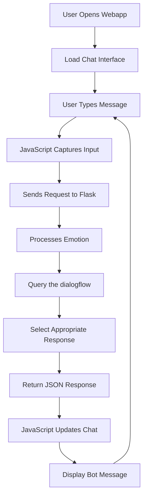

# Real-Time Chatbot with Emotion-Based Responses

## 🌟 Project Overview

This project implements a real-time chatbot that combines simple rule-based logic with emotion triggers to deliver appropriate responses. The system leverages Flask for backend processing, custom dialogue management and emotion-based triggers to create an engaging conversational experience.
The users can enjoy their time by sharing their thoughts & feelings to a chatbot which responds in real-time based on the predefined logic. The WebApp has access to quick buttons for simplicity and ease or users can write their message as well in the chat area.

**Live Demo:** [ https://real-time-chatbot-1.onrender.com](https://real-time-chatbot-1.onrender.com)

---

## 🎯 Project Approach

Our approach centers around developing a human-like conversational experience by integrating rule-based logic into chatbot responses. Now, Users can enjoy seamless conversation with the chatbot and can vent their frustation which makes their mood lighter. We've implemented a simple system that:

1. Simple assistant with rule-based logic dialogues
2. Analyzes user input for emotional intent
3. Triggers appropriate responses based on emotions
4. Maintains conversation flow through structured dialogue management
5. Provides real-time interaction with minimal latency

---

## 🏗️ System Architecture

```
┌─────────────────┐    ┌──────────────────┐    ┌─────────────────┐
│   Frontend      │    │   Flask Backend  │    │   Data Layer    │
│   (HTML/CSS/JS) │◄──►│   (app.py)       │◄──►│   (JSON files)  │
└─────────────────┘    └──────────────────┘    └─────────────────┘
         │                        │                        │
         │                        │                        │
         ▼                        ▼                        ▼
┌─────────────────┐    ┌──────────────────┐    ┌─────────────────┐
│ User Interface  │    │ Emotion Logic    │    │ Dialogue System │
│ - Chat Display  │    │ (logic.py)       │    │(dialogflow.json)│
│ - Input Field   │    │ - Sentiment      │    │ - Triggers      │
│ - Animations    │    │ - Context        │    │ - Responses     │
└─────────────────┘    └──────────────────┘    └─────────────────┘
```

---

## 📁 Project Structure

```plaintext
📁 Real_Time_Chatbot
├── app.py              → Main Flask backend
├── logic.py            → Logic engine to match input with responses
├── dialogflow.json          → Rule-based triggers and responses
├── index.html          → Frontend layout (chat UI)
├── styles.css           → Stylesheet for UI
├── scripts.js           → Handles frontend logic and animations
├── requirements.txt    → Python dependencies
```
---

## 🔧 Dependencies

### **Backend Dependencies**
```python
Flask==2.3.3           # Web framework for Python
gunicorn==23.0.0       # requires for hosting the app
```
---
## 🛠️ Tech Stack

- **Python Version**: 3.12
- **Framework**: Flask 3.1.1
- **Frontend**: Vanilla HTML/CSS/JavaScript
- **Data Format**: JSON for dialogue management
- **Version Control**: Git & GitHub
- **Cloud platform for hosting**: Render
- **Integrated development environment**: VS Code
---

## 🔄 Application Flow


![Uploading R<svg id="export-svg" width="100%" xmlns="http://www.w3.org/2000/svg" class="flowchart" style="max-width: 275.2593688964844px;" viewBox="0.00000762939453125 0 275.2593688964844 1011" role="graphics-document document" aria-roledescription="flowchart-v2"><style xmlns="http://www.w3.org/1999/xhtml">@import url("https://cdnjs.cloudflare.com/ajax/libs/font-awesome/6.2.0/css/all.min.css"); p {margin: 0;}</style><style>#export-svg{font-family:arial,sans-serif;font-size:14px;fill:#333;}@keyframes edge-animation-frame{from{stroke-dashoffset:0;}}@keyframes dash{to{stroke-dashoffset:0;}}#export-svg .edge-animation-slow{stroke-dasharray:9,5!important;stroke-dashoffset:900;animation:dash 50s linear infinite;stroke-linecap:round;}#export-svg .edge-animation-fast{stroke-dasharray:9,5!important;stroke-dashoffset:900;animation:dash 20s linear infinite;stroke-linecap:round;}#export-svg .error-icon{fill:#ffffff;}#export-svg .error-text{fill:#000000;stroke:#000000;}#export-svg .edge-thickness-normal{stroke-width:2px;}#export-svg .edge-thickness-thick{stroke-width:3.5px;}#export-svg .edge-pattern-solid{stroke-dasharray:0;}#export-svg .edge-thickness-invisible{stroke-width:0;fill:none;}#export-svg .edge-pattern-dashed{stroke-dasharray:3;}#export-svg .edge-pattern-dotted{stroke-dasharray:2;}#export-svg .marker{fill:#000000;stroke:#000000;}#export-svg .marker.cross{stroke:#000000;}#export-svg svg{font-family:arial,sans-serif;font-size:14px;}#export-svg p{margin:0;}#export-svg .label{font-family:arial,sans-serif;color:#333;}#export-svg .cluster-label text{fill:#000000;}#export-svg .cluster-label span{color:#000000;}#export-svg .cluster-label span p{background-color:transparent;}#export-svg .label text,#export-svg span{fill:#333;color:#333;}#export-svg .node rect,#export-svg .node circle,#export-svg .node ellipse,#export-svg .node polygon,#export-svg .node path{fill:#ffffff;stroke:#000000;stroke-width:2px;}#export-svg .rough-node .label text,#export-svg .node .label text,#export-svg .image-shape .label,#export-svg .icon-shape .label{text-anchor:middle;}#export-svg .node .katex path{fill:#000;stroke:#000;stroke-width:1px;}#export-svg .rough-node .label,#export-svg .node .label,#export-svg .image-shape .label,#export-svg .icon-shape .label{text-align:center;}#export-svg .node.clickable{cursor:pointer;}#export-svg .root .anchor path{fill:#000000!important;stroke-width:0;stroke:#000000;}#export-svg .arrowheadPath{fill:#000000;}#export-svg .edgePath .path{stroke:#000000;stroke-width:2px;}#export-svg .flowchart-link{stroke:#000000;fill:none;}#export-svg .edgeLabel{background-color:hsl(-120, 0%, 80%);text-align:center;}#export-svg .edgeLabel p{background-color:hsl(-120, 0%, 80%);}#export-svg .edgeLabel rect{opacity:0.5;background-color:hsl(-120, 0%, 80%);fill:hsl(-120, 0%, 80%);}#export-svg .labelBkg{background-color:rgba(204, 204, 204, 0.5);}#export-svg .cluster rect{fill:#ffffff;stroke:hsl(0, 0%, 90%);stroke-width:2px;}#export-svg .cluster text{fill:#000000;}#export-svg .cluster span{color:#000000;}#export-svg div.mermaidTooltip{position:absolute;text-align:center;max-width:200px;padding:2px;font-family:arial,sans-serif;font-size:12px;background:#ffffff;border:1px solid hsl(0, 0%, 90%);border-radius:2px;pointer-events:none;z-index:100;}#export-svg .flowchartTitleText{text-anchor:middle;font-size:18px;fill:#333;}#export-svg rect.text{fill:none;stroke-width:0;}#export-svg .icon-shape,#export-svg .image-shape{background-color:hsl(-120, 0%, 80%);text-align:center;}#export-svg .icon-shape p,#export-svg .image-shape p{background-color:hsl(-120, 0%, 80%);padding:2px;}#export-svg .icon-shape rect,#export-svg .image-shape rect{opacity:0.5;background-color:hsl(-120, 0%, 80%);fill:hsl(-120, 0%, 80%);}#export-svg .node .neo-node{stroke:#000000;}#export-svg [data-look="neo"].node rect,#export-svg [data-look="neo"].cluster rect,#export-svg [data-look="neo"].node polygon{stroke:url(#export-svg-gradient);filter:drop-shadow( 0px 1px 2px rgba(0, 0, 0, 0.25));}#export-svg [data-look="neo"].node path{stroke:url(#export-svg-gradient);stroke-width:2;}#export-svg [data-look="neo"].node .outer-path{filter:drop-shadow( 0px 1px 2px rgba(0, 0, 0, 0.25));}#export-svg [data-look="neo"].node .neo-line path{stroke:#000000;filter:none;}#export-svg [data-look="neo"].node circle{stroke:url(#export-svg-gradient);filter:drop-shadow( 0px 1px 2px rgba(0, 0, 0, 0.25));}#export-svg [data-look="neo"].node circle .state-start{fill:#000000;}#export-svg [data-look="neo"].statediagram-cluster rect{fill:#ffffff;stroke:url(#export-svg-gradient);stroke-width:2;}#export-svg [data-look="neo"].icon-shape .icon{fill:url(#export-svg-gradient);filter:drop-shadow( 0px 1px 2px rgba(0, 0, 0, 0.25));}#export-svg [data-look="neo"].icon-shape .icon-neo path{stroke:url(#export-svg-gradient);filter:drop-shadow( 0px 1px 2px rgba(0, 0, 0, 0.25));}#export-svg :root{--mermaid-font-family:"trebuchet ms",verdana,arial,sans-serif;}</style><g><marker id="export-svg_flowchart-v2-pointEnd" class="marker flowchart-v2" viewBox="0 0 11.5 14" refX="7.75" refY="7" markerUnits="userSpaceOnUse" markerWidth="10.5" markerHeight="14" orient="auto"><path d="M 0 0 L 11.5 7 L 0 14 z" class="arrowMarkerPath" style="stroke-width: 0; stroke-dasharray: 1, 0;"/></marker><marker id="export-svg_flowchart-v2-pointStart" class="marker flowchart-v2" viewBox="0 0 11.5 14" refX="4" refY="7" markerUnits="userSpaceOnUse" markerWidth="11.5" markerHeight="14" orient="auto"><polygon points="0,7 11.5,14 11.5,0" class="arrowMarkerPath" style="stroke-width: 0; stroke-dasharray: 1, 0;"/></marker><marker id="export-svg_flowchart-v2-pointEnd-margin" class="marker flowchart-v2" viewBox="0 0 11.5 14" refX="11.5" refY="7" markerUnits="userSpaceOnUse" markerWidth="10.5" markerHeight="14" orient="auto"><path d="M 0 0 L 11.5 7 L 0 14 z" class="arrowMarkerPath" style="stroke-width: 0; stroke-dasharray: 1, 0;"/></marker><marker id="export-svg_flowchart-v2-pointStart-margin" class="marker flowchart-v2" viewBox="0 0 11.5 14" refX="1" refY="7" markerUnits="userSpaceOnUse" markerWidth="11.5" markerHeight="14" orient="auto"><polygon points="0,7 11.5,14 11.5,0" class="arrowMarkerPath" style="stroke-width: 0; stroke-dasharray: 1, 0;"/></marker><marker id="export-svg_flowchart-v2-circleEnd" class="marker flowchart-v2" viewBox="0 0 10 10" refY="5" refX="10.75" markerUnits="userSpaceOnUse" markerWidth="14" markerHeight="14" orient="auto"><circle cx="5" cy="5" r="5" class="arrowMarkerPath" style="stroke-width: 0; stroke-dasharray: 1, 0;"/></marker><marker id="export-svg_flowchart-v2-circleStart" class="marker flowchart-v2" viewBox="0 0 10 10" refX="0" refY="5" markerUnits="userSpaceOnUse" markerWidth="14" markerHeight="14" orient="auto"><circle cx="5" cy="5" r="5" class="arrowMarkerPath" style="stroke-width: 0; stroke-dasharray: 1, 0;"/></marker><marker id="export-svg_flowchart-v2-circleEnd-margin" class="marker flowchart-v2" viewBox="0 0 10 10" refY="5" refX="12.25" markerUnits="userSpaceOnUse" markerWidth="14" markerHeight="14" orient="auto"><circle cx="5" cy="5" r="5" class="arrowMarkerPath" style="stroke-width: 0; stroke-dasharray: 1, 0;"/></marker><marker id="export-svg_flowchart-v2-circleStart-margin" class="marker flowchart-v2" viewBox="0 0 10 10" refX="-2" refY="5" markerUnits="userSpaceOnUse" markerWidth="14" markerHeight="14" orient="auto"><circle cx="5" cy="5" r="5" class="arrowMarkerPath" style="stroke-width: 0; stroke-dasharray: 1, 0;"/></marker><marker id="export-svg_flowchart-v2-crossEnd" class="marker cross flowchart-v2" viewBox="0 0 15 15" refX="17.7" refY="7.5" markerUnits="userSpaceOnUse" markerWidth="12" markerHeight="12" orient="auto"><path d="M 1,1 L 14,14 M 1,14 L 14,1" class="arrowMarkerPath" style="stroke-width: 2.5;"/></marker><marker id="export-svg_flowchart-v2-crossStart" class="marker cross flowchart-v2" viewBox="0 0 15 15" refX="-3.5" refY="7.5" markerUnits="userSpaceOnUse" markerWidth="12" markerHeight="12" orient="auto"><path d="M 1,1 L 14,14 M 1,14 L 14,1" class="arrowMarkerPath" style="stroke-width: 2.5; stroke-dasharray: 1, 0;"/></marker><marker id="export-svg_flowchart-v2-crossEnd-margin" class="marker cross flowchart-v2" viewBox="0 0 15 15" refX="17.7" refY="7.5" markerUnits="userSpaceOnUse" markerWidth="12" markerHeight="12" orient="auto"><path d="M 1,1 L 14,14 M 1,14 L 14,1" class="arrowMarkerPath" style="stroke-width: 2.5;"/></marker><marker id="export-svg_flowchart-v2-crossStart-margin" class="marker cross flowchart-v2" viewBox="0 0 15 15" refX="-3.5" refY="7.5" markerUnits="userSpaceOnUse" markerWidth="12" markerHeight="12" orient="auto"><path d="M 1,1 L 14,14 M 1,14 L 14,1" class="arrowMarkerPath" style="stroke-width: 2.5; stroke-dasharray: 1, 0;"/></marker><g class="root"><g class="clusters"/><g class="edgePaths"><path d="M185.50312042236328,53L185.50312042236328,78L185.50312042236328,99" id="L_A_B_0" class="edge-thickness-normal edge-pattern-solid edge-thickness-normal edge-pattern-solid flowchart-link" style="stroke-dasharray: 0 0 37 9; stroke-dashoffset: 0;;" data-edge="true" data-et="edge" data-id="L_A_B_0" data-points="W3sieCI6MTg1LjUwMzEyMDQyMjM2MzI4LCJ5Ijo1M30seyJ4IjoxODUuNTAzMTIwNDIyMzYzMjgsInkiOjc4fSx7IngiOjE4NS41MDMxMjA0MjIzNjMyOCwieSI6MTAzfV0=" marker-end="url(#export-svg_flowchart-v2-pointEnd-margin)"/><path d="M185.50312042236328,148L185.50312042236328,173L185.50312042236328,194" id="L_B_C_0" class="edge-thickness-normal edge-pattern-solid edge-thickness-normal edge-pattern-solid flowchart-link" style="stroke-dasharray: 0 0 37 9; stroke-dashoffset: 0;;" data-edge="true" data-et="edge" data-id="L_B_C_0" data-points="W3sieCI6MTg1LjUwMzEyMDQyMjM2MzI4LCJ5IjoxNDh9LHsieCI6MTg1LjUwMzEyMDQyMjM2MzI4LCJ5IjoxNzN9LHsieCI6MTg1LjUwMzEyMDQyMjM2MzI4LCJ5IjoxOTh9XQ==" marker-end="url(#export-svg_flowchart-v2-pointEnd-margin)"/><path d="M151.94999614514802,243L123.38949858592521,262.1520524221015Q114.66874694824219,268 114.66874694824219,278.5L114.66874694824219,289" id="L_C_D_0" class="edge-thickness-normal edge-pattern-solid edge-thickness-normal edge-pattern-solid flowchart-link" style="stroke-dasharray: 0 0 55.2607421875 9; stroke-dashoffset: 0;;" data-edge="true" data-et="edge" data-id="L_C_D_0" data-points="W3sieCI6MTUxLjk0OTk5NjE0NTE0ODAyLCJ5IjoyNDN9LHsieCI6MTE0LjY2ODc0Njk0ODI0MjE5LCJ5IjoyNjh9LHsieCI6MTE0LjY2ODc0Njk0ODI0MjE5LCJ5IjoyOTN9XQ==" marker-end="url(#export-svg_flowchart-v2-pointEnd-margin)"/><path d="M114.66874694824219,338L114.66874694824219,363L114.66874694824219,384" id="L_D_E_0" class="edge-thickness-normal edge-pattern-solid edge-thickness-normal edge-pattern-solid flowchart-link" style="stroke-dasharray: 0 0 37 9; stroke-dashoffset: 0;;" data-edge="true" data-et="edge" data-id="L_D_E_0" data-points="W3sieCI6MTE0LjY2ODc0Njk0ODI0MjE5LCJ5IjozMzh9LHsieCI6MTE0LjY2ODc0Njk0ODI0MjE5LCJ5IjozNjN9LHsieCI6MTE0LjY2ODc0Njk0ODI0MjE5LCJ5IjozODh9XQ==" marker-end="url(#export-svg_flowchart-v2-pointEnd-margin)"/><path d="M114.66874694824219,433L114.66874694824219,458L114.66874694824219,479" id="L_E_F_0" class="edge-thickness-normal edge-pattern-solid edge-thickness-normal edge-pattern-solid flowchart-link" style="stroke-dasharray: 0 0 37 9; stroke-dashoffset: 0;;" data-edge="true" data-et="edge" data-id="L_E_F_0" data-points="W3sieCI6MTE0LjY2ODc0Njk0ODI0MjE5LCJ5Ijo0MzN9LHsieCI6MTE0LjY2ODc0Njk0ODI0MjE5LCJ5Ijo0NTh9LHsieCI6MTE0LjY2ODc0Njk0ODI0MjE5LCJ5Ijo0ODN9XQ==" marker-end="url(#export-svg_flowchart-v2-pointEnd-margin)"/><path d="M114.66874694824219,528L114.66874694824219,553L114.66874694824219,574" id="L_F_G_0" class="edge-thickness-normal edge-pattern-solid edge-thickness-normal edge-pattern-solid flowchart-link" style="stroke-dasharray: 0 0 37 9; stroke-dashoffset: 0;;" data-edge="true" data-et="edge" data-id="L_F_G_0" data-points="W3sieCI6MTE0LjY2ODc0Njk0ODI0MjE5LCJ5Ijo1Mjh9LHsieCI6MTE0LjY2ODc0Njk0ODI0MjE5LCJ5Ijo1NTN9LHsieCI6MTE0LjY2ODc0Njk0ODI0MjE5LCJ5Ijo1Nzh9XQ==" marker-end="url(#export-svg_flowchart-v2-pointEnd-margin)"/><path d="M114.66874694824219,623L114.66874694824219,648L114.66874694824219,669" id="L_G_H_0" class="edge-thickness-normal edge-pattern-solid edge-thickness-normal edge-pattern-solid flowchart-link" style="stroke-dasharray: 0 0 37 9; stroke-dashoffset: 0;;" data-edge="true" data-et="edge" data-id="L_G_H_0" data-points="W3sieCI6MTE0LjY2ODc0Njk0ODI0MjE5LCJ5Ijo2MjN9LHsieCI6MTE0LjY2ODc0Njk0ODI0MjE5LCJ5Ijo2NDh9LHsieCI6MTE0LjY2ODc0Njk0ODI0MjE5LCJ5Ijo2NzN9XQ==" marker-end="url(#export-svg_flowchart-v2-pointEnd-margin)"/><path d="M114.66874694824219,718L114.66874694824219,743L114.66874694824219,764" id="L_H_I_0" class="edge-thickness-normal edge-pattern-solid edge-thickness-normal edge-pattern-solid flowchart-link" style="stroke-dasharray: 0 0 37 9; stroke-dashoffset: 0;;" data-edge="true" data-et="edge" data-id="L_H_I_0" data-points="W3sieCI6MTE0LjY2ODc0Njk0ODI0MjE5LCJ5Ijo3MTh9LHsieCI6MTE0LjY2ODc0Njk0ODI0MjE5LCJ5Ijo3NDN9LHsieCI6MTE0LjY2ODc0Njk0ODI0MjE5LCJ5Ijo3Njh9XQ==" marker-end="url(#export-svg_flowchart-v2-pointEnd-margin)"/><path d="M114.66874694824219,813L114.66874694824219,838L114.66874694824219,859" id="L_I_J_0" class="edge-thickness-normal edge-pattern-solid edge-thickness-normal edge-pattern-solid flowchart-link" style="stroke-dasharray: 0 0 37 9; stroke-dashoffset: 0;;" data-edge="true" data-et="edge" data-id="L_I_J_0" data-points="W3sieCI6MTE0LjY2ODc0Njk0ODI0MjE5LCJ5Ijo4MTN9LHsieCI6MTE0LjY2ODc0Njk0ODI0MjE5LCJ5Ijo4Mzh9LHsieCI6MTE0LjY2ODc0Njk0ODI0MjE5LCJ5Ijo4NjN9XQ==" marker-end="url(#export-svg_flowchart-v2-pointEnd-margin)"/><path d="M114.66874694824219,908L114.66874694824219,922.3767512293756Q114.66874694824219,933 123.49186257814097,938.9165906588178L148.6278050450783,955.7722104465148" id="L_J_K_0" class="edge-thickness-normal edge-pattern-solid edge-thickness-normal edge-pattern-solid flowchart-link" style="stroke-dasharray: 0 0 55.24165344238281 9; stroke-dashoffset: 0;;" data-edge="true" data-et="edge" data-id="L_J_K_0" data-points="W3sieCI6MTE0LjY2ODc0Njk0ODI0MjE5LCJ5Ijo5MDh9LHsieCI6MTE0LjY2ODc0Njk0ODI0MjE5LCJ5Ijo5MzN9LHsieCI6MTUxLjk0OTk5NjE0NTE0ODAyLCJ5Ijo5NTh9XQ==" marker-end="url(#export-svg_flowchart-v2-pointEnd-margin)"/><path d="M219.05624469957854,958L247.5143782665856,938.9165906588178Q256.3374938964844,933 256.3374938964844,922.3767512293756L256.3374938964844,885.5L256.3374938964844,838L256.3374938964844,790.5L256.3374938964844,743L256.3374938964844,695.5L256.3374938964844,648L256.3374938964844,600.5L256.3374938964844,553L256.3374938964844,505.5L256.3374938964844,458L256.3374938964844,410.5L256.3374938964844,363L256.3374938964844,315.5L256.3374938964844,278.62324877062446Q256.3374938964844,268 247.5143782665856,262.08340934118223L222.37843579964826,245.22778955348514" id="L_K_C_0" class="edge-thickness-normal edge-pattern-solid edge-thickness-normal edge-pattern-solid flowchart-link edge-animation-fast" style=";" data-edge="true" data-et="edge" data-id="L_K_C_0" data-points="W3sieCI6MjE5LjA1NjI0NDY5OTU3ODU0LCJ5Ijo5NTh9LHsieCI6MjU2LjMzNzQ5Mzg5NjQ4NDQsInkiOjkzM30seyJ4IjoyNTYuMzM3NDkzODk2NDg0NCwieSI6ODg1LjV9LHsieCI6MjU2LjMzNzQ5Mzg5NjQ4NDQsInkiOjgzOH0seyJ4IjoyNTYuMzM3NDkzODk2NDg0NCwieSI6NzkwLjV9LHsieCI6MjU2LjMzNzQ5Mzg5NjQ4NDQsInkiOjc0M30seyJ4IjoyNTYuMzM3NDkzODk2NDg0NCwieSI6Njk1LjV9LHsieCI6MjU2LjMzNzQ5Mzg5NjQ4NDQsInkiOjY0OH0seyJ4IjoyNTYuMzM3NDkzODk2NDg0NCwieSI6NjAwLjV9LHsieCI6MjU2LjMzNzQ5Mzg5NjQ4NDQsInkiOjU1M30seyJ4IjoyNTYuMzM3NDkzODk2NDg0NCwieSI6NTA1LjV9LHsieCI6MjU2LjMzNzQ5Mzg5NjQ4NDQsInkiOjQ1OH0seyJ4IjoyNTYuMzM3NDkzODk2NDg0NCwieSI6NDEwLjV9LHsieCI6MjU2LjMzNzQ5Mzg5NjQ4NDQsInkiOjM2M30seyJ4IjoyNTYuMzM3NDkzODk2NDg0NCwieSI6MzE1LjV9LHsieCI6MjU2LjMzNzQ5Mzg5NjQ4NDQsInkiOjI2OH0seyJ4IjoyMTkuMDU2MjQ0Njk5NTc4NTQsInkiOjI0M31d" marker-end="url(#export-svg_flowchart-v2-pointEnd)"/></g><g class="edgeLabels"><g class="edgeLabel"><g class="label" data-id="L_A_B_0" transform="translate(0, 0)"><foreignObject width="0" height="0"><div style="display: table-cell; white-space: normal; line-height: 1.5; max-width: 200px; text-align: center;" xmlns="http://www.w3.org/1999/xhtml" class="labelBkg"><span class="edgeLabel"></span></div></foreignObject></g></g><g class="edgeLabel"><g class="label" data-id="L_B_C_0" transform="translate(0, 0)"><foreignObject width="0" height="0"><div style="display: table-cell; white-space: normal; line-height: 1.5; max-width: 200px; text-align: center;" xmlns="http://www.w3.org/1999/xhtml" class="labelBkg"><span class="edgeLabel"></span></div></foreignObject></g></g><g class="edgeLabel"><g class="label" data-id="L_C_D_0" transform="translate(0, 0)"><foreignObject width="0" height="0"><div style="display: table-cell; white-space: normal; line-height: 1.5; max-width: 200px; text-align: center;" xmlns="http://www.w3.org/1999/xhtml" class="labelBkg"><span class="edgeLabel"></span></div></foreignObject></g></g><g class="edgeLabel"><g class="label" data-id="L_D_E_0" transform="translate(0, 0)"><foreignObject width="0" height="0"><div style="display: table-cell; white-space: normal; line-height: 1.5; max-width: 200px; text-align: center;" xmlns="http://www.w3.org/1999/xhtml" class="labelBkg"><span class="edgeLabel"></span></div></foreignObject></g></g><g class="edgeLabel"><g class="label" data-id="L_E_F_0" transform="translate(0, 0)"><foreignObject width="0" height="0"><div style="display: table-cell; white-space: normal; line-height: 1.5; max-width: 200px; text-align: center;" xmlns="http://www.w3.org/1999/xhtml" class="labelBkg"><span class="edgeLabel"></span></div></foreignObject></g></g><g class="edgeLabel"><g class="label" data-id="L_F_G_0" transform="translate(0, 0)"><foreignObject width="0" height="0"><div style="display: table-cell; white-space: normal; line-height: 1.5; max-width: 200px; text-align: center;" xmlns="http://www.w3.org/1999/xhtml" class="labelBkg"><span class="edgeLabel"></span></div></foreignObject></g></g><g class="edgeLabel"><g class="label" data-id="L_G_H_0" transform="translate(0, 0)"><foreignObject width="0" height="0"><div style="display: table-cell; white-space: normal; line-height: 1.5; max-width: 200px; text-align: center;" xmlns="http://www.w3.org/1999/xhtml" class="labelBkg"><span class="edgeLabel"></span></div></foreignObject></g></g><g class="edgeLabel"><g class="label" data-id="L_H_I_0" transform="translate(0, 0)"><foreignObject width="0" height="0"><div style="display: table-cell; white-space: normal; line-height: 1.5; max-width: 200px; text-align: center;" xmlns="http://www.w3.org/1999/xhtml" class="labelBkg"><span class="edgeLabel"></span></div></foreignObject></g></g><g class="edgeLabel"><g class="label" data-id="L_I_J_0" transform="translate(0, 0)"><foreignObject width="0" height="0"><div style="display: table-cell; white-space: normal; line-height: 1.5; max-width: 200px; text-align: center;" xmlns="http://www.w3.org/1999/xhtml" class="labelBkg"><span class="edgeLabel"></span></div></foreignObject></g></g><g class="edgeLabel"><g class="label" data-id="L_J_K_0" transform="translate(0, 0)"><foreignObject width="0" height="0"><div style="display: table-cell; white-space: normal; line-height: 1.5; max-width: 200px; text-align: center;" xmlns="http://www.w3.org/1999/xhtml" class="labelBkg"><span class="edgeLabel"></span></div></foreignObject></g></g><g class="edgeLabel"><g class="label" data-id="L_K_C_0" transform="translate(0, 0)"><foreignObject width="0" height="0"><div style="display: table-cell; white-space: normal; line-height: 1.5; max-width: 200px; text-align: center;" xmlns="http://www.w3.org/1999/xhtml" class="labelBkg"><span class="edgeLabel"></span></div></foreignObject></g></g></g><g class="nodes"><g class="node default" id="flowchart-A-0" data-id="A" data-node="true" data-et="node" data-look="neo" transform="translate(185.50312042236328, 30.5)"><rect class="basic label-container" style="" data-id="A" x="-81.2437515258789" y="-22.5" width="162.4875030517578" height="45" stroke="url(#gradient)"/><g class="label" style="" transform="translate(-65.2437515258789, -10.5)"><rect/><foreignObject width="130.4875030517578" height="21"><div style="display: table-cell; white-space: normal; line-height: 1.5; max-width: 200px; text-align: center;" xmlns="http://www.w3.org/1999/xhtml"><span class="nodeLabel"><p>User Opens Webapp</p></span></div></foreignObject></g></g><g class="node default" id="flowchart-B-1" data-id="B" data-node="true" data-et="node" data-look="neo" transform="translate(185.50312042236328, 125.5)"><rect class="basic label-container" style="" data-id="B" x="-77.48749923706055" y="-22.5" width="154.9749984741211" height="45" stroke="url(#gradient)"/><g class="label" style="" transform="translate(-61.48749923706055, -10.5)"><rect/><foreignObject width="122.9749984741211" height="21"><div style="display: table-cell; white-space: normal; line-height: 1.5; max-width: 200px; text-align: center;" xmlns="http://www.w3.org/1999/xhtml"><span class="nodeLabel"><p>Load Chat Interface</p></span></div></foreignObject></g></g><g class="node default" id="flowchart-C-3" data-id="C" data-node="true" data-et="node" data-look="neo" transform="translate(185.50312042236328, 220.5)"><rect class="basic label-container" style="" data-id="C" x="-81.625" y="-22.5" width="163.25" height="45" stroke="url(#gradient)"/><g class="label" style="" transform="translate(-65.625, -10.5)"><rect/><foreignObject width="131.25" height="21"><div style="display: table-cell; white-space: normal; line-height: 1.5; max-width: 200px; text-align: center;" xmlns="http://www.w3.org/1999/xhtml"><span class="nodeLabel"><p>User Types Message</p></span></div></foreignObject></g></g><g class="node default" id="flowchart-D-5" data-id="D" data-node="true" data-et="node" data-look="neo" transform="translate(114.66874694824219, 315.5)"><rect class="basic label-container" style="" data-id="D" x="-96.54375457763672" y="-22.5" width="193.08750915527344" height="45" stroke="url(#gradient)"/><g class="label" style="" transform="translate(-80.54375457763672, -10.5)"><rect/><foreignObject width="161.08750915527344" height="21"><div style="display: table-cell; white-space: normal; line-height: 1.5; max-width: 200px; text-align: center;" xmlns="http://www.w3.org/1999/xhtml"><span class="nodeLabel"><p>JavaScript Captures Input</p></span></div></foreignObject></g></g><g class="node default" id="flowchart-E-7" data-id="E" data-node="true" data-et="node" data-look="neo" transform="translate(114.66874694824219, 410.5)"><rect class="basic label-container" style="" data-id="E" x="-90.3187484741211" y="-22.5" width="180.6374969482422" height="45" stroke="url(#gradient)"/><g class="label" style="" transform="translate(-74.3187484741211, -10.5)"><rect/><foreignObject width="148.6374969482422" height="21"><div style="display: table-cell; white-space: normal; line-height: 1.5; max-width: 200px; text-align: center;" xmlns="http://www.w3.org/1999/xhtml"><span class="nodeLabel"><p>Sends Request to Flask</p></span></div></foreignObject></g></g><g class="node default" id="flowchart-F-9" data-id="F" data-node="true" data-et="node" data-look="neo" transform="translate(114.66874694824219, 505.5)"><rect class="basic label-container" style="" data-id="F" x="-76.3062515258789" y="-22.5" width="152.6125030517578" height="45" stroke="url(#gradient)"/><g class="label" style="" transform="translate(-60.306251525878906, -10.5)"><rect/><foreignObject width="120.61250305175781" height="21"><div style="display: table-cell; white-space: normal; line-height: 1.5; max-width: 200px; text-align: center;" xmlns="http://www.w3.org/1999/xhtml"><span class="nodeLabel"><p>Processes Emotion</p></span></div></foreignObject></g></g><g class="node default" id="flowchart-G-11" data-id="G" data-node="true" data-et="node" data-look="neo" transform="translate(114.66874694824219, 600.5)"><rect class="basic label-container" style="" data-id="G" x="-79.81875228881836" y="-22.5" width="159.63750457763672" height="45" stroke="url(#gradient)"/><g class="label" style="" transform="translate(-63.81875228881836, -10.5)"><rect/><foreignObject width="127.63750457763672" height="21"><div style="display: table-cell; white-space: normal; line-height: 1.5; max-width: 200px; text-align: center;" xmlns="http://www.w3.org/1999/xhtml"><span class="nodeLabel"><p>Query the dialogflow</p></span></div></foreignObject></g></g><g class="node default" id="flowchart-H-13" data-id="H" data-node="true" data-et="node" data-look="neo" transform="translate(114.66874694824219, 695.5)"><rect class="basic label-container" style="" data-id="H" x="-106.66875457763672" y="-22.5" width="213.33750915527344" height="45" stroke="url(#gradient)"/><g class="label" style="" transform="translate(-90.66875457763672, -10.5)"><rect/><foreignObject width="181.33750915527344" height="21"><div style="display: table-cell; white-space: normal; line-height: 1.5; max-width: 200px; text-align: center;" xmlns="http://www.w3.org/1999/xhtml"><span class="nodeLabel"><p>Select Appropriate Response</p></span></div></foreignObject></g></g><g class="node default" id="flowchart-I-15" data-id="I" data-node="true" data-et="node" data-look="neo" transform="translate(114.66874694824219, 790.5)"><rect class="basic label-container" style="" data-id="I" x="-91.09375" y="-22.5" width="182.1875" height="45" stroke="url(#gradient)"/><g class="label" style="" transform="translate(-75.09375, -10.5)"><rect/><foreignObject width="150.1875" height="21"><div style="display: table-cell; white-space: normal; line-height: 1.5; max-width: 200px; text-align: center;" xmlns="http://www.w3.org/1999/xhtml"><span class="nodeLabel"><p>Return JSON Response</p></span></div></foreignObject></g></g><g class="node default" id="flowchart-J-17" data-id="J" data-node="true" data-et="node" data-look="neo" transform="translate(114.66874694824219, 885.5)"><rect class="basic label-container" style="" data-id="J" x="-93.4312515258789" y="-22.5" width="186.8625030517578" height="45" stroke="url(#gradient)"/><g class="label" style="" transform="translate(-77.4312515258789, -10.5)"><rect/><foreignObject width="154.8625030517578" height="21"><div style="display: table-cell; white-space: normal; line-height: 1.5; max-width: 200px; text-align: center;" xmlns="http://www.w3.org/1999/xhtml"><span class="nodeLabel"><p>JavaScript Updates Chat</p></span></div></foreignObject></g></g><g class="node default" id="flowchart-K-19" data-id="K" data-node="true" data-et="node" data-look="neo" transform="translate(185.50312042236328, 980.5)"><rect class="basic label-container" style="" data-id="K" x="-81.7562484741211" y="-22.5" width="163.5124969482422" height="45" stroke="url(#gradient)"/><g class="label" style="" transform="translate(-65.7562484741211, -10.5)"><rect/><foreignObject width="131.5124969482422" height="21"><div style="display: table-cell; white-space: normal; line-height: 1.5; max-width: 200px; text-align: center;" xmlns="http://www.w3.org/1999/xhtml"><span class="nodeLabel"><p>Display Bot Message</p></span></div></foreignObject></g></g></g></g></g><defs><filter id="drop-shadow" height="130%" width="130%"><feDropShadow dx="4" dy="4" stdDeviation="0" flood-opacity="0.06" flood-color="#000000"/></filter></defs><defs><filter id="drop-shadow-small" height="150%" width="150%"><feDropShadow dx="2" dy="2" stdDeviation="0" flood-opacity="0.06" flood-color="#000000"/></filter></defs><linearGradient id="export-svg-gradient" gradientUnits="objectBoundingBox" x1="0%" y1="0%" x2="100%" y2="0%"><stop offset="0%" stop-color="#0042eb" stop-opacity="1"/><stop offset="100%" stop-color="#eb0042" stop-opacity="1"/></linearGradient></svg>eal_Time_Chatbot_flowchart.svg…]()

### **Detailed Process Flow**

1. **User Interaction**: User visits the webapp and types a message
2. **Frontend Processing**: JavaScript validates input and sends a request
3. **Backend Reception**: Flask receives the message via POST request
4. **Emotion Analysis**: logic.py analyzes the message for emotion based triggers
5. **Response Selection**: dialogflow.json is queried for appropriate responses
6. **Frontend Update**: JavaScript receives response and updates chat interface
7. **Visual Feedback**: Message appears with smooth animations

---


## 📝 Installation & Setup


# Clone the repository:
```bash
git clone https://github.com/anwesha0123/Real-Time-Chatbot.git
```

# Install dependencies:
```
pip install -r requirements.txt
```

# Run the application locally:
```
python app.py
```

# Access the webapp using the live link:
```
https://real-time-chatbot-1.onrender.com
```
(please wait for 1 min to load the website if you're running it for the first time)

