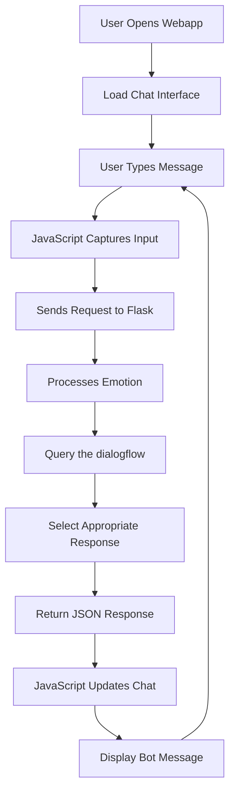

# Real-Time Chatbot with Emotion-Based Responses

## 🌟 Project Overview

This project implements a real-time chatbot that combines simple rule-based logic with emotion triggers to deliver appropriate responses. The system leverages Flask for backend processing, custom dialogue management and emotion-based triggers to create an engaging conversational experience.
The users can enjoy their time by sharing their thoughts & feelings to a chatbot which responds in real-time based on the predefined logic. The WebApp has access to quick buttons for simplicity and ease or users can write their message as well in the chat area.

## 🎥 Live Demo

### Video Walkthrough
https://github.com/user-attachments/assets/36804d9a-3372-4bf1-8f87-f756dd611c5a

### Interactive Demo
**Live Application:** [ https://real-time-chatbot-1.onrender.com](https://real-time-chatbot-1.onrender.com)

---

## 🎯 Project Approach

Our approach centers around developing a human-like conversational experience by integrating rule-based logic into chatbot responses. Now, Users can enjoy seamless conversation with the chatbot and can vent their frustation which makes their mood lighter. We've implemented a simple system which is a:

1. Simple assistant with rule-based logic dialogues
2. Analyzes user input for emotional intent
3. Triggers appropriate responses based on emotions
4. Maintains conversation flow through structured dialogue management
5. Provides real-time interaction with minimal latency

---

## 🏗️ System Architecture

```
┌─────────────────┐    ┌──────────────────┐    ┌─────────────────┐
│   Frontend      │    │   Flask Backend  │    │   Data Layer    │
│  (HTML/CSS/JS)  │◄──►│   (app.py)       │◄──►│  (JSON files)   │
└─────────────────┘    └──────────────────┘    └─────────────────┘
         │                        │                        │
         │                        │                        │
         ▼                        ▼                        ▼
┌─────────────────┐    ┌──────────────────┐    ┌─────────────────┐
│ User Interface  │    │ Emotion Logic    │    │ Dialogue System │
│ - Chat Display  │    │ (logic.py)       │    │(dialogflow.json)│
│ - Input Field   │    │ - Sentiment      │    │ - Triggers      │
│ - Animations    │    │ - Context        │    │ - Responses     │
└─────────────────┘    └──────────────────┘    └─────────────────┘
```
---

## 📁 Project Structure

```plaintext
📁 Real_Time_Chatbot
├── app.py                   → Main Flask backend
├── logic.py                 → Logic engine to match input with responses
├── dialogflow.json          → Rule-based triggers and responses
├── index.html               → Frontend layout (chat UI)
├── styles.css               → Stylesheet for UI
├── scripts.js               → Handles frontend logic and animations
├── requirements.txt         → Python dependencies
├── README.md                → This file 
```
---

## 🔧 Dependencies

### **Backend Dependencies**
```python
Flask==2.3.3           # Web framework for Python
gunicorn==23.0.0       # requires for hosting the app
```
---
## 🛠️ Tech Stack

- **Python Version**: 3.12
- **Framework**: Flask 3.1.1
- **Frontend**: HTML/CSS/JavaScript
- **Data Format**: JSON for dialogue management
- **Version Control**: Git & GitHub
- **Cloud platform for hosting**: Render
- **Integrated Development Environment**: VS Code
---

## 🔄 Application Flow



### **Detailed Process Flow**

1. **User Interaction**: User visits the webapp and types a message
2. **Frontend Processing**: JavaScript validates input and sends a request
3. **Backend Reception**: Flask receives the message via POST request
4. **Emotion Analysis**: logic.py analyzes the message for emotion based triggers
5. **Response Selection**: dialogflow.json is queried for appropriate responses
6. **Frontend Update**: JavaScript receives response and updates chat interface
7. **Visual Feedback**: Message appears with smooth animations

---

## 📝 Installation & Setup

# Clone the repository:
```
git clone https://github.com/anwesha0123/Real-Time-Chatbot.git
```
# Enter the current directory:
```
cd Real-Time-Chatbot
```

# Install dependencies:
```
pip install -r requirements.txt
```

# Run the application locally:
```
python app.py
```

# Access the webapp using the live link:
```
https://real-time-chatbot-1.onrender.com
```
(please wait for 1 min to load the website if you're running it for the first time)

---
## 🙋‍♀️ Author

Anwesha Das <br>
GitHub: https://github.com/anwesha0123 <br>
Email: anweshadas22@tnu.in


